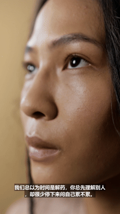
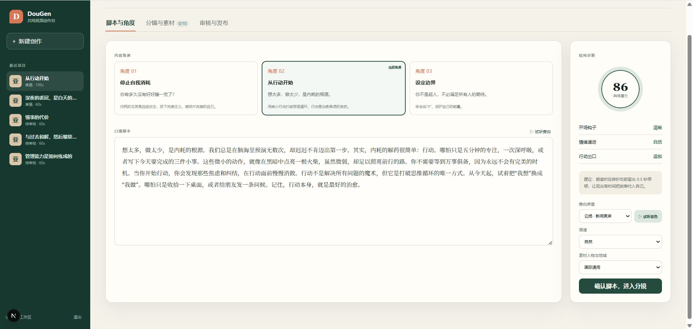
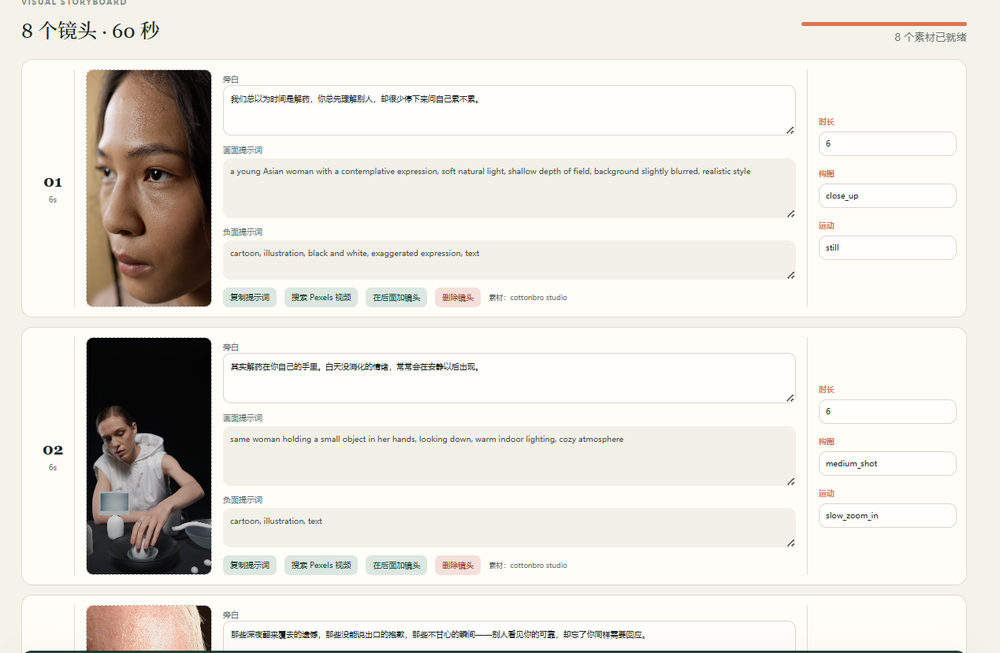
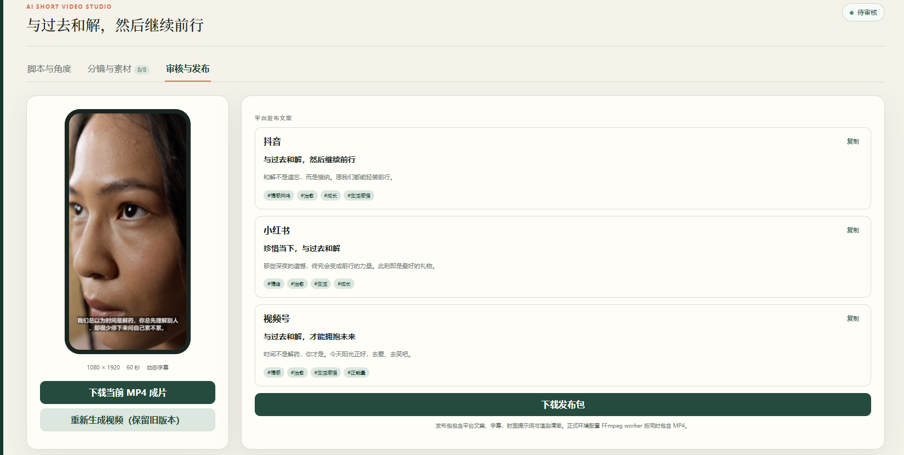

<div align="center">

# 🎬 Sparkreel · AI 共鸣短视频创作台

**输入一个话题，自动生成内容角度 → 口播脚本 → 分镜 → 旁白配音 → 字幕 → 竖屏成片 → 平台发布文案**

简体中文 ·
[功能特性](#-功能特性) ·
[快速开始](#-快速开始) ·
[使用指南](#-使用指南-user-guide) ·
[平台发布方案](#-平台发布方案) ·
[常见问题](#-常见问题)


</div>

---

Sparkreel 是一个**个人使用**的 AI 短视频创作台。你只需要把脑海里的一个话题或一段文案放进去，平台就会生成**中文情绪共鸣短视频**的完整方案：内容角度、口播脚本、分镜、画面提示词、旁白配音、动态字幕，以及抖音 / 小红书 / 视频号三个平台的发布文案。

素材可以用 **Pexels** 一键自动补齐，也可以在外部图片 / 视频生成工具中生成后上传，最后用 **FFmpeg** 合成 1080×1920 竖屏 MP4。

> 💡 没有 API Key 也能跑：未配置 DeepSeek 时，平台使用内置的确定性「演示生成器」产出可用的脚本和分镜，方便先体验完整流程。

---

## 📺 效果展示

以下为 Sparkreel 实际生成的竖屏成片（9:16 · 1080×1920 · 烧录动态字幕）效果片段：

<table>
<tr>
<td align="center" width="25%">
<br/>
<b>从行动开始</b><br/><sub>100 秒 · 内耗主题</sub>
</td>
<td align="center" width="25%">
<br/>
<b>懂事的代价</b><br/><sub>60 秒 · 情绪共鸣</sub>
</td>
<td align="center" width="25%">
<br/>
<b>与过去和解，然后继续前行</b><br/><sub>54 秒 · 治愈成长</sub>
</td>
<td align="center" width="25%">
<br/>
<b>深夜的委屈，是白天的懂事在求救</b><br/><sub>60 秒 · 情感疗愈</sub>
</td>
</tr>
</table>

> 上方为 GIF 预览，画质经压缩。完整 MP4 由 FFmpeg 合成，包含中文旁白配音与逐句动态字幕。

---

## 🎯 功能特性

- 🧠 **一句话生成完整方案**：输入话题后，自动产出内容角度、口播脚本、6–10 个分镜与平台文案。
- ⏱ **30 / 60 / 90 秒**三档时长，默认 90 秒，竖屏 9:16（1080×1920）输出。
- 🤖 **多模型接入**：默认 DeepSeek 生成内容，OpenAI / Claude 作为预留 Provider（需自备 API Key），不调用任何网页订阅。
- 🎨 **三种视觉方向**：卡通动画、漫画分镜、亚洲面庞写实。
- 🇨🇳 **素材人物与地域偏好**：中国风/亚洲面孔、国际通用、无人景物三选一，Pexels 检索关键词自动适配。
- 🗣 **Microsoft Edge TTS 中文配音**：多音色可选、四档语速、一键试听。
- 🎬 **分镜级精修**：逐镜编辑旁白、字幕、画面提示词、负面提示词、时长、构图、运动；支持新增 / 插入 / 删除镜头。
- 🖼 **素材双通道**：手动上传图片 / 视频，或一键搜索 Pexels 竖屏动态素材。
- 🔊 **音画自动对齐**：渲染前先生成并测量旁白时长，自动延长视频确保成片时长 ≥ 语音时长并保留结尾缓冲。
- 🗂 **版本不覆盖**：每次重新生成都会产出 `标题-1.mp4`、`标题-2.mp4`…，审核页保留全部历史成片下载。
- 📦 **一键发布包**：导出含 MP4 链接、SRT 字幕、封面提示词、各平台标题/正文/标签的 JSON 发布包。
- 🔐 **单用户私有工作台**：登录鉴权、上传文件 MIME/扩展名/大小/文件头多重校验。

---

## 🖼 界面预览

Sparkreel 采用「左侧项目列表 + 右侧三段式工作流」布局，三个工作标签页对应完整创作流程：

| 标签页 | 作用 |
|--------|------|
| **① 脚本与角度** | 选择/切换内容角度，编辑口播脚本，试听旁白，调整音色/语速/素材偏好，查看结构诊断 |
| **② 分镜与素材** | 逐镜编辑旁白、**画面提示词**、**负面提示词**、时长、构图、运动；上传或搜索 Pexels 素材；新增/删除镜头 |
| **③ 审核与发布** | 9:16 手机预览、下载当前/历史 MP4、查看三平台发布文案、下载发布包 |

### ① 脚本与角度

输入话题后自动生成多个内容角度，点击切换；右侧含结构诊断、音色/语速/素材偏好。



### ② 分镜与素材

逐镜编辑旁白、画面提示词与负面提示词，配合上传素材或一键搜索 Pexels。



### ③ 审核与发布

9:16 手机预览成片，下载 MP4 与历史版本，复制抖音/小红书/视频号发布文案，导出发布包。



---

## 🧩 技术架构

```
Next.js (App Router) ──► DeepSeek / 预留 OpenAI·Claude   (内容生成)
        │
        ├──► Pexels API                                  (动态素材)
        ├──► Microsoft Edge TTS / Piper                  (中文配音)
        ├──► FFmpeg                                       (字幕烧录 + 竖屏合成)
        │
        └──► 存储层：本地 storage/ 目录  或  PostgreSQL + S3 + BullMQ/Redis (生产)
```

- 未配置 `DATABASE_URL` 时，项目数据保存到 `storage/projects.json`。
- 未配置 S3 时，素材与成片保存在本地 `storage/` 目录。
- 配置 Redis 后可运行后台 worker，将渲染任务异步化。

---

## 📦 环境要求

| 组件 | 说明 |
|------|------|
| **Node.js** | 建议 20 LTS 及以上 |
| **FFmpeg** | 必需，用于配音测量、字幕烧录与视频合成 |
| **Edge TTS** | 可选，提供中文旁白配音（未配置则跳过配音） |
| **DeepSeek API Key** | 可选，不配置则使用内置演示生成器 |
| **Pexels API Key** | 可选，用于自动补齐动态素材 |
| **PostgreSQL / Redis / S3** | 可选，仅生产部署需要 |

---

## 🚀 快速开始

### 方式一：本地开发（推荐先用这个体验）

```powershell
# 1. 复制环境变量模板（按需填入 API Key）
Copy-Item .env.example .env

# 2. 安装依赖
npm.cmd install

# 3. 生成 Prisma Client
npm.cmd run db:generate

# 4. 启动开发服务器
npm.cmd run dev
```

打开浏览器访问：

```text
http://localhost:3000
```

> 首次进入需要登录，账号密码由 `.env` 中的 `ADMIN_PASSWORD` 决定（或使用 `ADMIN_PASSWORD_HASH`）。

如需生产构建：

```powershell
npm.cmd run build
npm.cmd run start
```

### 方式二：Docker Compose 部署

```powershell
docker compose up -d --build
```

生产链路：

```text
Next.js ──► PostgreSQL / S3 ──► BullMQ / Redis ──► Edge TTS / Piper ──► FFmpeg
```

如果配置了 Redis，可额外运行后台 worker 处理渲染队列：

```powershell
npm.cmd run worker
```

---

## ⚙️ 配置说明

`.env` 中只在服务端保存 API Key，**请勿提交真实密钥**（`.env` 已在 `.gitignore` 中忽略）。

### 常用配置

```env
# 登录鉴权
AUTH_SECRET=至少32位随机字符
ADMIN_PASSWORD=你的登录密码

# DeepSeek（不填则使用演示生成器）
DEEPSEEK_API_KEY=
DEEPSEEK_BASE_URL=https://api.deepseek.com
DEEPSEEK_MODEL=deepseek-chat
NEXT_PUBLIC_DEEPSEEK_ENABLED=true

# 媒体工具
FFMPEG_PATH=C:\path\to\ffmpeg.exe
EDGE_TTS_PATH=C:\path\to\edge-tts.exe
EDGE_TTS_VOICE=zh-CN-XiaoyiNeural
EDGE_TTS_RATE=-5%

# 素材
PEXELS_API_KEY=
ALLOW_MOCK_RENDER=false
```

### 可选生产配置

```env
DATABASE_URL=postgresql://...
REDIS_URL=redis://...
S3_ENDPOINT=http://...
S3_BUCKET=sparkreel
S3_ACCESS_KEY_ID=
S3_SECRET_ACCESS_KEY=
S3_PUBLIC_URL=
```

完整字段见 [`.env.example`](.env.example)。

---

## 📖 使用指南 (User Guide)

### 第 1 步 · 输入创意（新建创作页）

在「今天想说什么？」中填写：

| 字段 | 说明 | 示例 |
|------|------|------|
| **话题/文案** | 一个话题，或一段想表达的话 | 为什么越懂事的人，越容易在深夜感到委屈？ |
| **目标受众** | 视频面向谁 | 25-35 岁职场人 |
| **情绪基调** | 你想传递的情绪 | 克制、温暖、有力量 |
| **表达禁区** | 不希望出现的表达方式 | 说教、贩卖焦虑、夸张承诺 |
| **视频时长** | 30 / 60 / 90 秒 | 90 秒 |
| **素材人物与地域** | 中国风·亚洲面孔 / 国际通用 / 无人景物 | 🇨🇳 中国风 |
| **旁白声音 + 语速** | Edge TTS 音色与语速，可试听 | 晓伊 · 自然偏慢 |
| **视觉方向** | 卡通动画 / 漫画分镜 / 亚洲面庞 | 亚洲面庞 |
| **内容模型** | DeepSeek（或预留 OpenAI/Claude） | DeepSeek |

点击 **「一键生成完整视频 →」**，系统会自动生成脚本分镜，并尝试补齐素材、配音、合成视频，完成后跳转到「审核与发布」。

### 第 2 步 · 脚本与角度


- **内容角度**：系统给出多个切入角度（如「停止自我消耗」「从行动开始」「设定边界」），点击卡片即可切换；切换后会按新角度**重新生成脚本和分镜**。
- **口播脚本**：可直接在文本框中编辑，失焦自动保存；点「试听旁白」用所选音色朗读。
- **结构诊断**：查看开场钩子、情绪递进、行动出口的评估与改进建议（含共鸣潜力评分）。
- 右侧可随时调整**旁白声音、语速、素材人物与地域**。
- 确认后点「确认脚本，进入分镜」。

### 第 3 步 · 分镜与素材


每个镜头卡片可编辑：

- **旁白 / 字幕**（旁白即字幕，同步更新）
- **画面提示词（Prompt）**：描述这一镜「要出现什么」，用于外部图片/视频生成工具或 Pexels 检索。例：
  `a young Asian woman with a contemplative expression, soft natural light, shallow depth of field, realistic style`
- **负面提示词（Negative Prompt）**：告诉生成模型「不要出现什么」。例：
  `cartoon, illustration, black and white, exaggerated expression, text`
- **时长 / 构图（如 close_up、medium_shot）/ 运动（如 still、slow_zoom_in）**
- **素材**：上传图片/视频（PNG/JPG/MP4），或点「搜索 Pexels 视频」一键补齐；已用素材会标注来源作者
- **镜头操作**：复制提示词、在后面加镜头、删除镜头

顶部进度条显示素材就绪情况（如 `8/8`）。点 **「一键补齐素材并生成视频」** 自动完成剩余流程，或在素材就绪后点「生成审核预览」。

> 修改脚本、音色、素材、分镜或提示词后，当前成片会被标记为需重新生成，但历史版本仍保留。

### 第 4 步 · 审核与发布


- **9:16 手机预览**：播放成片，查看分辨率（1080×1920）、时长与动态字幕。
- **下载成片**：下载当前 MP4，或「重新生成视频（保留旧版本）」。
- **历史成片**：列出每一版（第 N 版 · 时长 · 时间）可单独下载。
- **平台发布文案**：抖音 / 小红书 / 视频号三个版本，一键复制标题+正文+标签。
- **下载发布包**：导出包含全部产物的 JSON。

---

## 📤 平台发布方案

Sparkreel 在生成阶段就会为**抖音、小红书、视频号**三个平台分别产出原生发布文案，并打包所有发布所需素材。

### 三平台文案

| 平台 | 标识 | 文案风格 | 默认标签示例 |
|------|------|----------|--------------|
| **抖音** | `DOUYIN` | 短钩子、强情绪、口语化 | #情绪共鸣 #治愈 #成年人 |
| **小红书** | `XIAOHONGSHU` | 标题党 + 干货感 + 共情 | #情绪疗愈 #自我成长 #生活感悟 |
| **视频号** | `WECHAT_CHANNELS` | 温和、克制、面向熟人社交 | #情感 #成长 #共鸣 |

在「审核与发布」页，每个平台卡片提供独立的**标题、正文、话题标签**，点「复制」即可拿到「标题 + 正文 + #标签」的完整文本，直接粘贴到对应平台发布。

### 发布包（一键导出 JSON）

点击「下载发布包」得到 `标题-发布包.json`，结构如下：

```jsonc
{
  "projectId": "...",
  "title": "懂事的代价",
  "video": "当前成片 MP4 链接",
  "videos": [ /* 全部历史版本 */ ],
  "subtitles": "标准 SRT 字幕文本",
  "coverPrompt": "封面画面提示词（取自首镜）",
  "platformCopies": [
    { "platform": "DOUYIN",          "title": "...", "body": "...", "tags": [...] },
    { "platform": "XIAOHONGSHU",     "title": "...", "body": "...", "tags": [...] },
    { "platform": "WECHAT_CHANNELS", "title": "...", "body": "...", "tags": [...] }
  ],
  "manifest": {
    "resolution": "1080x1920",
    "duration": 90,
    "scenes": 8,
    "exportedAt": "ISO 时间"
  }
}
```

### 推荐发布流程

1. 在审核页确认成片无误，**下载当前 MP4**。
2. **下载发布包**，留存字幕、封面提示词与发布清单。
3. 进入目标平台（抖音/小红书/视频号），上传 MP4。
4. 回到 Sparkreel 对应平台卡片点「复制」，把标题、正文、标签粘贴到发布页。
5. 需要封面时，用发布包里的 `coverPrompt` 到外部图片工具生成封面。

> ⚠️ 平台合规：默认禁止真人身份仿冒、未授权人脸克隆、名人肖像与明显侵权素材。Sparkreel 仅辅助选题、结构、分镜与批量生产效率，**不承诺流量结果**，也不包含自动发布功能。

---

## 🎙 进阶配置

### 配音（TTS）

- 默认使用 **Microsoft Edge TTS**，需在 `EDGE_TTS_PATH` 指定可执行文件，`EDGE_TTS_VOICE` 设置中文音色（如 `zh-CN-XiaoyiNeural`）。
- 语速通过 `EDGE_TTS_RATE` 控制（如 `-5%`），界面也提供舒缓/自然偏慢/自然/明快四档。
- 也支持本地 **Piper** 模型（`PIPER_PATH` / `PIPER_MODEL`）。

### 素材（Pexels）

- 配置 `PEXELS_API_KEY` 后即可一键搜索竖屏动态素材。
- 「中国风」偏好会优先检索 `chinese woman` / `chinese man` / `chinese portrait` / `china street` / `beijing street` / `shanghai street` 等关键词。

### 负面提示词

负面提示词告诉图片/视频生成模型「不要出现什么」，例如：

```text
文字，水印，logo，畸形手指，低清晰度，过度磨皮，名人脸，未成年人
```

主要用于复制到外部生成工具，减少常见画面问题。Pexels 搜索仅使用正向提示词。

---

## 🤔 常见问题

**Q：没有 DeepSeek API Key 能用吗？**
A：能。不配置时使用内置确定性演示生成器，可体验完整脚本/分镜/发布流程；设置 `NEXT_PUBLIC_DEEPSEEK_ENABLED=true` 并填入 Key 后启用真实生成。

**Q：渲染失败 / 没有 MP4？**
A：确认 `FFMPEG_PATH` 指向有效的 FFmpeg，且同目录存在 `ffprobe`。开发期可设 `ALLOW_MOCK_RENDER=true` 跳过真实合成。

**Q：旁白没有声音？**
A：检查 `EDGE_TTS_PATH` 是否正确、能否独立运行；未配置 TTS 时会跳过配音。

**Q：数据存在哪里？**
A：未配置 `DATABASE_URL` 时存于 `storage/projects.json`；成片在 `storage/renders/<project-id>/`。

**Q：成片会覆盖旧版本吗？**
A：不会。每次重新生成产出 `标题-1.mp4`、`标题-2.mp4`…，历史版本永久保留。

---

## ✅ 验证

```powershell
npm.cmd test            # 单元测试
npx.cmd tsc --noEmit    # 类型检查
npm.cmd run lint        # 代码规范
npm.cmd run build       # 生产构建
```

> lint 可能提示 `` 可替换为 Next `<Image />`，这是性能建议，不影响功能。

---

## 🔐 安全与边界

- 上传支持 JPEG、PNG、WebP、MP4、WebM、MP3、WAV，并校验 MIME、扩展名、文件大小与文件头签名。
- 默认禁止真人身份仿冒、未授权人脸克隆、明显侵权素材和名人肖像生成。
- 首版仅面向个人工作台，不含注册、多租户、团队协作、付费与自动发布。

---

## 📄 License

本项目基于 [MIT License](LICENSE) 开源。
